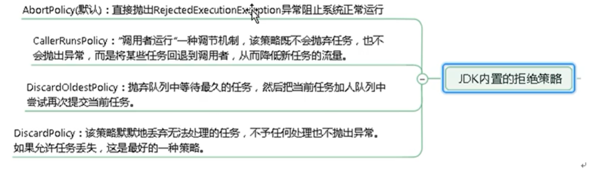

# bilibili

`https://www.bilibili.com/video/BV1Kw411Z7dF?p=38&spm_id_from=pageDriver`


# 前言

之前对于多线程编程的了解仅仅局限于继承Thread，重写run方法。。。。

系统的再过一遍java并发编程（虽然现在的公司不用。。

学习时长：15Day（周末谈恋爱。。时间紧、任务重

这里只记录学习过程中遇到的问题和不解的地方或重要的知识点，详细学习见学习资料

# 开始

## java.util.concurrent

### 进程和线程

### 线程状态

- NEW。（新建
- RUNNABLE。（准备就绪
- BLOCKED。（阻塞
- WAITING。（不见不散
- TIMED_WAITING。（过时不候
- TERMINATED。（终结

### wait和sleep

interrupted方法？

### 并发（concurrency）与并行（parallellism）

**并行**(parallel)：指在同一时刻，有多条指令在多个处理器上同时执行。所以无论从微观还是从宏观来看，二者都是一起执行的。

**并发**(concurrency)：指在同一时刻只能有一条指令执行，但多个进程指令被快速的轮换执行，使得在宏观上具有多个进程同时执行的效果，但在微观上并不是同时执行的，只是把时间分成若干段，使多个进程快速交替的执行。

### 管程（monitor）

又名：监视器、锁

### 用户线程和守护线程

用户线程：平时用到的线程，自定义线程

守护线程：运行在后台，是一种特殊的线程，比如垃圾回收。

 **没有用户线程，都是守护线程，JVM结束，只要有一个用户线程，则存活**

## LOCK

### Synchronized（同步锁

修饰代码块、方法、类

### Lock接口与sync对比

在性能上来说，如果竞争资源不激烈，两者的性能是差不多的，而当竞争资源 非常激烈时（即有大量线程同时竞争），此时 Lock 的性能要远远优于 synchronized。

### ReentrantLock（可重入锁

### ReadWriteLock（读写锁

## 线程间通信

共享内存和消息传递

## 集合的线程安全

### 多个线程对集合同时操作

java.util.ConcurrentModificationException

foreach来删除元素也会报错

### 安全集合

- Collections.synchronizedList
- Vector
- CopyOnWriteArrayList（重点

1. 独占锁效率低：采用读写分离思想解决 
2. 写线程获取到锁，其他写线程阻塞 
3. 复制思想

## 锁对象

对于普通同步方法，锁是当前实例对象。 

对于静态同步方法，锁是当前类的 Class 对象。

 对于同步方法块，锁是 Synchonized 括号里配置的对象

## Callable&Future 接口

## JUC 三大辅助类 

- CountDownLatch: 减少计数 

-  CyclicBarrier: 循环栅栏 

-  Semaphore: 信号灯

## 读写锁

（1）公平选择性：支持非公平（默认）和公平的锁获取方式，吞吐量还是非公 平优于公平。 （2）重进入：读锁和写锁都支持线程重进入。 

（3）锁降级：遵循获取写锁、获取读锁再释放写锁的次序，写锁能够降级成为 读锁

## 阻塞队列

### BlockingQueue

消息队列？

-  ArrayBlockingQueue(常用)
-  LinkedBlockingQueue(常用）

## ThreadPool 线程池

```java
new ThreadPoolExecutor(int corePoolSize, // 常驻线程数量（核心
                              int maximumPoolSize,// 最大线程数
                              long keepAliveTime, // 线程存活时间
                              TimeUnit unit,// 线程存活时间单位
                              BlockingQueue<Runnable> workQueue,// 阻塞队列
                              ThreadFactory threadFactory,// 线程工厂
                              RejectedExecutionHandler handler// 拒绝策略)
```

### 工作流程

核心线程先处理，核心线程用尽后，后来的线程要在阻塞队列中等待

阻塞队列满了之后再来新线程，才会开辟最大线程数中的线程

最大线程数满了之后才会走拒绝策略

### 拒绝策略



# 分支合并框架

## 异步回调

```
CompletableFuture
```